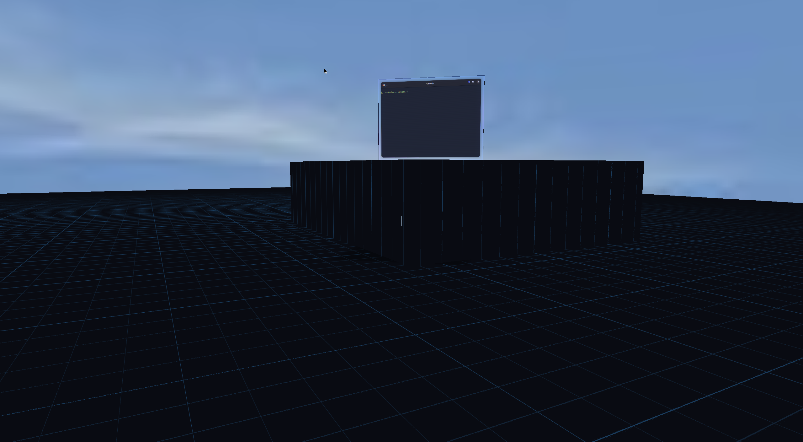

# shady



A small experimental **3D Wayland compositor** based on the TinyWL example from
wlroots 0.20.2.

Shady treats normal xdg-shell applications as physical objects in a shared 3D
world. Windows can move through depth, tilt, wobble, collide with the world, and
be picked up and thrown while you walk around the desktop in first-person mode.

The project is intentionally experimental. The imported TinyWL example is CC0;
see [its license](LICENSES/tinywl-CC0.txt).

## Highlights

- Custom GLES2 3D renderer for Wayland surfaces
- Perspective depth, per-window Z position, persistent 3D rotation and solid window sides
- Flexible wobble/deformation with deformation-aware 3D ray picking
- First-person WASD + mouse-look camera with gravity, jumping and a player collision body
- Shared world box colliders used by both window physics and the FPS camera
- Floor and elevated platform collision, step-up, side blocking and wall sliding
- Grab, carry, place and throw windows in 3D; mouse wheel adjusts held distance
- Optional window gravity with tilted-footprint landing, bounce, friction and sliding
- Orbit camera with pan, zoom and raycast pointer interaction
- Equirectangular sky environment from a P6 PPM image
- Floor grid, projected window shadows and lit 3D window shells
- Animated crumple-style closing and compositor-owned close snapshots
- Configurable features and key bindings

The world/collider layer is intentionally reusable. It currently contains a
floor and a test platform and is being prepared for loaded 3D environment
geometry.

## Controls

### First-person mode

| Input | Action |
|---|---|
| F2 | Enter / leave first-person mode |
| W / A / S / D | Move |
| Mouse | Look around |
| Space | Jump |
| Left click | Grab / release the window at the center of view |
| Right click while holding | Throw the held window |
| Scroll while holding | Move the held window closer / farther |
| F3 | Toggle navigation capture / normal client input |
| F4 | Toggle window gravity |
| F5 | Toggle the 3D picking debug ray |

The FPS camera has a physical body. It lands on world colliders, can step onto
the current test platform, is blocked by its sides, and slides along obstacles.
Windows with gravity enabled use the same world collider set for support.

### Orbit mode

| Input | Action |
|---|---|
| Right-button drag | Orbit camera |
| Alt + middle-button drag | Pan camera |
| Alt + scroll wheel | Zoom |
| Alt + Shift + scroll wheel | Move the focused window along Z |
| Scroll wheel (no Alt) | Forward to the client |
| Middle-click (no Alt) | Forward to the client |
| Alt + arrows / WASD | Pan |
| Alt + Q / E | Orbit yaw |
| Alt + `=` / `-` | Zoom |
| Alt + `0` | Reset camera |
| Alt + F11 | Animate and request window close |
| F1 | Cycle windows |

Orbit-mode pointer interaction raycasts against transformed window geometry,
including the wobble-deformed front and the 3D shell.

## Building on NixOS

Enable Nix flakes (`nix-command` and `flakes`). The committed `flake.lock`
pins the development environment; Shady currently targets **wlroots 0.20.2**.

```sh
nix develop
./build.sh
```

`build.sh` reconfigures Meson and builds with Ninja. The equivalent manual
commands are:

```sh
meson setup --reconfigure build
ninja -C build
```

For the first configure, use `meson setup build` if the build directory does
not yet exist.

Run nested inside an existing Wayland session:

```sh
WLR_BACKENDS=wayland ./build/shady
```

Or start a client automatically:

```sh
WLR_BACKENDS=wayland ./build/shady -s foot
```

For the repository's current development setup:

```sh
./test.sh
```

Shady requires the **GLES2** renderer for its custom shaders; do not force the
pixman renderer. The compositor prints the `WAYLAND_DISPLAY` it allocated so
additional clients can be launched from another terminal.

## Configuration

Shady reads `$XDG_CONFIG_HOME/shady/config`, or
`~/.config/shady/config` when `XDG_CONFIG_HOME` is unset. Use
`shady -c /path/to/config` to select another file.

```ini
physics_enabled = true
window_gravity = false
window_wobble = true
window_sides = true
shadows = true
floor = true
close_animation = true
fps_mode = true

# Optional equirectangular environment.
# The current loader accepts binary P6 PPM images.
sky = false
sky_path = /path/to/sky.ppm
```

Boolean values accept `true/false`, `yes/no`, `on/off`, or `1/0`.
Missing configuration files use built-in defaults. Settings are loaded at
startup.

### Key bindings

Bindings use `bind.action = Mod+Key`. Supported modifiers are `Alt`,
`Shift`, `Ctrl`, and `Super`; key names are XKB names.

```ini
bind.quit = Escape
bind.cycle_windows = F1
bind.close_window = Alt+F11
bind.fps_toggle = F2
bind.fps_capture = F3
bind.gravity_toggle = F4
bind.debug_ray = F5
bind.camera_left = Alt+Left
bind.camera_right = Alt+Right
bind.camera_up = Alt+Up
bind.camera_down = Alt+Down
bind.camera_yaw_left = Alt+q
bind.camera_yaw_right = Alt+e
bind.camera_zoom_in = Alt+equal
bind.camera_zoom_out = Alt+minus
bind.camera_reset = Alt+0
```

These are the built-in defaults, so only bindings you want to change need to be
specified.

## Build-time modules

Meson exposes the current internal feature modules:

```text
-Dphysics=enabled|disabled|auto
-Dfps=enabled|disabled|auto
-Dwindow_motion=enabled|disabled|auto
-Dclose_animation=enabled|disabled|auto
-Dscene_effects=enabled|disabled|auto
```

These are compile-time internal modules rather than dynamically loaded plugins.

## Project layout

```text
src/
  modules/
    physics/          window gravity and collision response
    fps/              first-person movement, grabbing and player collision
    window_motion/    wobble and inertial window rotation
    close_animation/  close state machine
    scene_effects/    floor/shadow scene effects
    environment/      sky environment
  render/             GLES2 pipeline, math and 3D picking
  world/              shared floor/platform/collider definitions
shaders/               editable GLSL
```

The important architectural boundary is that environment geometry registers
world colliders, while physics and FPS movement query those colliders instead of
knowing about individual world objects.

## Current status

Shady is a research/experimental compositor, not a production desktop. The
current focus is turning the desktop into a coherent navigable 3D world.

Working experiments include deformable solid windows, full-shell picking,
first-person grabbing and throwing, optional window physics, finite world
surfaces, elevated platforms, shared camera/window collision, a sky environment,
and projected shadows.

Areas still under active development include richer environment geometry and
collision, more accurate shadow receivers, multi-output behavior, and general
interaction/rendering polish.
