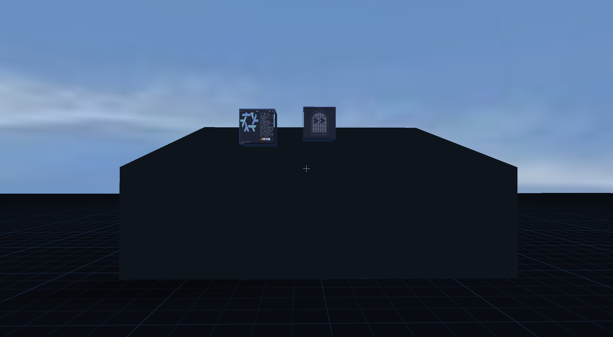

# shady



Shady is a small experimental **3D Wayland compositor** built on wlroots 0.20.2 and inspired by TinyWL.

Normal xdg-shell applications become physical objects in a shared 3D world. Windows can fold into cubes, move through depth, wobble, collide with authored 3D environments, and be picked up and thrown while you walk around the desktop.

The project is intentionally experimental. The imported TinyWL example is CC0; see [its license](LICENSES/tinywl-CC0.txt).

## Highlights

- Custom GLES2 renderer for Wayland surfaces in a perspective 3D world
- First-person WASD + mouse-look navigation, jumping and player collision
- Windows fold into physical cubes in FPS mode and can be grabbed, carried and thrown
- Window gravity, bounce, friction, wobble and collision response
- OBJ environment loading with authored `collision_*` geometry
- Triangle-vs-cube SAT collision for OBJ environments
- Built-in floor plus reusable world/collider abstraction
- Equirectangular P6 PPM sky environment
- Floor grid, projected shadows and lit 3D window shells
- Orbit camera with 3D ray-picking
- Animated crumple-style window closing
- **Lua 5.4 scripting** for configuration, key bindings and runtime events
- Window recovery tools and automatic respawn when a cube falls out of the world

## Controls

### First-person mode

| Input | Action |
|---|---|
| F2 | Enter / leave first-person mode |
| F3 | Toggle navigation capture / normal client interaction |
| F4 | Toggle window gravity |
| F5 | Toggle collision / picking debug rendering |
| W / A / S / D | Move |
| Mouse | Look |
| Space | Jump |
| Left click | Grab / release the cube at the center of view |
| Right click while holding | Throw the held cube |
| Scroll while holding | Change held distance |

The development Lua config also binds:

| Input | Action |
|---|---|
| F6 | Toggle gravity through Lua |
| F7 | Expand all windows / fold all windows |
| F8 | Print all live windows to the log |
| F9 | Respawn all windows |
| Ctrl + Alt + Q | Quit through Lua |

The F7–F9 bindings are implemented in `test-shady.lua`, not hard-coded compositor controls. They are examples of what can be built with the scripting API.

### Orbit mode

| Input | Action |
|---|---|
| Right-button drag | Orbit camera |
| Alt + middle-button drag | Pan camera |
| Alt + scroll | Zoom |
| Alt + Shift + scroll | Move focused window along Z |
| F1 | Cycle windows |
| Alt + F11 | Animate and request window close |
| Alt + arrows | Pan |
| Alt + Q / E | Orbit yaw |
| Alt + `=` / `-` | Zoom |
| Alt + `0` | Reset camera |

## Building on NixOS

Shady currently targets **wlroots 0.20.2**. The Nix development shell provides wlroots, GLES/EGL, Lua 5.4, Meson and Ninja.

```sh
nix develop
./build.sh
```

`build.sh` reconfigures Meson and builds with Ninja:

```sh
meson setup --reconfigure build
ninja -C build
```

For a new build directory, run `meson setup build` first.

Run Shady nested inside an existing Wayland session:

```sh
WLR_BACKENDS=wayland ./build/shady
```

Or launch a client automatically:

```sh
WLR_BACKENDS=wayland ./build/shady -s foot
```

For the repository development setup:

```sh
./test.sh
```

Shady requires the **GLES2** renderer for its custom shaders. The compositor prints the allocated `WAYLAND_DISPLAY` so more clients can be launched from another terminal.

## Lua scripting

Shady embeds **Lua 5.4**. Lua is intended for ricing, configuration and compositor orchestration while rendering, collision and physics stay in C.

By default Shady looks for:

```text
$XDG_CONFIG_HOME/shady/init.lua
```

or, when `XDG_CONFIG_HOME` is unset:

```text
~/.config/shady/init.lua
```

For development or testing, `SHADY_LUA_INIT` can select another script. The repository's `test.sh` uses `test-shady.lua`.

### Configuration from Lua

```lua
shady.config("physics_enabled", true)
shady.config("window_gravity", true)
shady.config("window_wobble", true)
shady.config("shadows", true)
shady.config("fps_mode", true)

shady.config("sky", true)
shady.config("sky_path", "/path/to/sky.ppm")

shady.config("environment_obj", true)
shady.config("environment_obj_path", "/path/to/world.obj")
```

Built-in key bindings can also be configured:

```lua
shady.config("bind.fps_toggle", "F2")
shady.config("bind.fps_capture", "F3")
shady.config("bind.gravity_toggle", "F4")
shady.config("bind.debug_ray", "F5")
```

### Runtime key bindings

Lua callbacks can be attached to XKB key combinations:

```lua
shady.bind("F6", function()
    shady.toggle_gravity()
    shady.log("gravity toggled")
end)

shady.bind("Ctrl+Alt+q", function()
    shady.quit()
end)
```

Supported modifier names are `Alt`, `Shift`, `Ctrl`/`Control`, and `Super`/`Logo`.

### Window events

```lua
shady_events = {
    window_map = function(window)
        shady.log("opened: " .. window.app_id .. " / " .. window.title)
    end,

    window_unmap = function(window)
        shady.log("closed: " .. window.app_id)
    end,
}
```

Window event tables currently expose `title`, `app_id`, and world `z`.

### Runtime API

Current scripting calls include:

```lua
shady.log("hello")
shady.toggle_gravity()
shady.toggle_fps()
shady.quit()

local windows = shady.windows()
shady.expand_all()
shady.fold_all()
shady.respawn_all()

shady.camera("yaw", 1.0)
shady.camera("pitch", -0.2)
shady.camera("distance", 2.5)
shady.camera("target_x", 0.0)
shady.camera("target_y", 0.0)
shady.camera("target_z", -1.0)
```

`shady.windows()` returns the currently live toplevels as Lua tables. The API is intentionally small and experimental; the goal is to grow it without moving physics or rendering hot loops into Lua.

## 3D environments

Shady can load OBJ geometry as both visual environment geometry and authored collision geometry.

Collision groups/objects use a `collision_` prefix:

```obj
g collision_room
v -0.75 -0.62 -1.60
v  0.75 -0.62 -1.60
v  0.75 -0.62 -0.40
f 1 2 3
```

Faces in collision groups are converted into triangle colliders. Window cubes first use broad-phase bounds and then exact triangle-vs-AABB SAT tests, allowing sloped and non-box environment geometry instead of treating every OBJ group as a solid rectangular volume.

The repository includes `assets/test-room.obj` as a development example.

## Window recovery

Thrown windows can leave the useful part of the world. Shady therefore has two recovery mechanisms:

- Window physics automatically respawns a cube after it falls sufficiently far below the world or travels beyond the configured internal Z safety limit.
- Lua exposes `shady.respawn_all()` for manual recovery. The development config binds this to **F9**.

`shady.windows()` can be used to inspect which clients are still alive even when their physical cubes are no longer visible.

## Legacy configuration

The original INI-style configuration loader is still available for compatibility:

```ini
physics_enabled = true
window_gravity = false
window_wobble = true
shadows = true
floor = true
fps_mode = true

bind.fps_toggle = F2
bind.gravity_toggle = F4
```

Use `shady -c /path/to/config` to load one. Lua is now the preferred path for development and ricing.

## Project layout

```text
src/
  assets/             OBJ and mesh loading
  modules/
    lua/              embedded Lua runtime and Shady scripting API
    physics/          cube gravity and world collision
    fps/              first-person movement, grabbing and throwing
    window_motion/    wobble and inertial rotation
    close_animation/  close state machine
    scene_effects/    floor and shadow effects
    environment/      visual environment loading
  render/             GLES2 pipeline, math, picking and debug rendering
  world/              shared world and collider representation
assets/               development OBJ environments
shaders/              editable GLSL
```

The important architectural boundary is that the world owns collision geometry. Physics and interaction query that shared representation rather than embedding knowledge of individual environment objects.

Lua sits above that core as an orchestration layer:

```text
Wayland / wlroots
       |
       v
   Shady C core
   /    |     \
render physics world
       |
       v
  Lua scripting
```

## Build-time modules

Meson currently exposes these internal feature modules:

```text
-Dphysics=enabled|disabled|auto
-Dfps=enabled|disabled|auto
-Dwindow_motion=enabled|disabled|auto
-Dclose_animation=enabled|disabled|auto
-Dscene_effects=enabled|disabled|auto
```

These are compile-time internal modules rather than dynamically loaded plugins.

## Current status

Shady is a research/experimental compositor, not a production desktop.

The current focus is building a coherent **physical 3D desktop** with a scriptable user-facing layer. Working experiments include folded window cubes, grabbing and throwing, window physics, authored OBJ collision meshes, triangle SAT collision, FPS navigation, sky rendering, shadows, Lua key bindings/events, live-window inspection and out-of-world recovery.

Areas still under active development include richer Lua window objects, per-window scripting actions, more accurate player collision against triangle geometry, richer environment/world semantics, better shadow receivers, multi-output behavior and general rendering/interaction polish.
