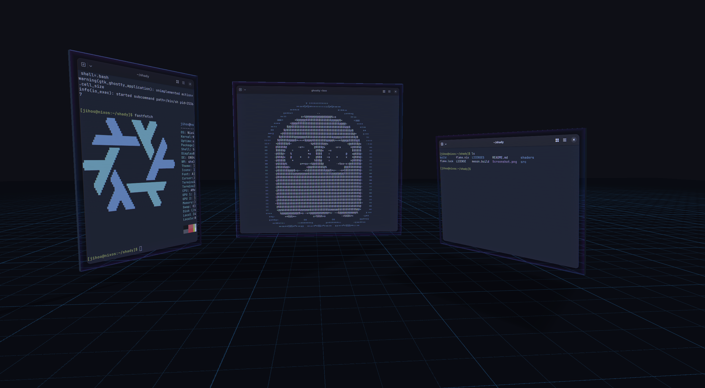

# shady



A small experimental **3D Wayland compositor** built on the TinyWL example from
wlroots 0.20.2.

Shady renders normal xdg-shell applications as textured 3D objects. Windows can
be moved through depth, tilted, deformed with a flexible wobble effect, picked
with 3D raycasts, and carried around while walking through the desktop in a
first-person camera.

The project is intentionally experimental: the goal is to explore what a
Wayland desktop feels like when windows are objects in a shared 3D space rather
than rectangles permanently attached to a 2D plane.

The imported TinyWL example is CC0; see [its license](LICENSES/tinywl-CC0.txt).

## Current features

- Custom GLES2 3D rendering pipeline for Wayland surfaces
- Perspective depth and per-window Z positioning
- Solid 3D window shells with thickness, lit side faces, and back faces
- Flexible 3D wobble/deformation with deformation-aware ray picking
- Persistent per-window 3D rotation
- Orbit camera with pan and zoom
- First-person camera with WASD movement, mouse look, gravity, and jumping
- Full-shell 3D picking in first-person mode, including front, sides, and back
- Grab, carry, rotate, place, and throw windows through 3D space
- Adjustable grab distance with the scroll wheel
- Optional window gravity with rotation-aware floor contact, bounce, friction, and sliding
- FPS client-input mode so applications can receive normal keyboard input
- Automatic cursor recentering while FPS navigation capture is active
- Horizontal reference floor and projected window shadows
- Animated crumple-style window closing
- Compositor-owned close snapshots for applications that show a confirmation dialog
- Editable GLSL under `shaders/`; rendering code lives under `src/render/`

## Controls

### First-person mode

| Input | Action |
|-------|--------|
| F2 | Enter / leave first-person mode |
| W / A / S / D | Move |
| Mouse | Look around |
| Space | Jump |
| Left click | Grab / release the window at the center of view |
| Right click while holding | Throw the held window in the view direction |
| Scroll while holding a window | Move the held window closer / farther away |
| F3 | Toggle FPS navigation capture / normal client input |
| F4 | Toggle window gravity |

When a held window is released, its 3D position and rotation are preserved.
Thrown windows carry linear and angular motion through the scene. With window
gravity enabled, released windows fall onto the floor, bounce on impact, react
to their current rotation, and lose sliding/spinning energy through friction.

While FPS navigation capture is active, Shady consumes relative mouse motion
for camera look and keeps the logical cursor centered. Switching back to client
input with F3 therefore returns the pointer near the center instead of leaving
it parked at a screen edge.

### Orbit mode

| Input | Action |
|-------|--------|
| Right-button drag | Orbit camera |
| Alt + middle-button drag | Pan camera |
| Alt + scroll wheel | Zoom |
| Alt + Shift + scroll wheel | Move the focused window along Z |
| Scroll wheel (no Alt) | Forward to the client |
| Middle-click (no Alt) | Forward to the client |
| Alt + arrows / WASD | Pan |
| Alt + Q / E | Orbit yaw |
| Alt + `=` / `-` | Zoom |
| Alt + `0` | Reset camera |
| Alt + F11 | Animate and request window close |
| F1 | Cycle windows |

Pointer interaction in orbit mode is raycast onto the transformed window
geometry. Picking follows the wobble-deformed front mesh and the solid 3D shell,
so interaction remains aligned when a window is tilted or viewed from the side.

## NixOS development

Enable Nix flakes (`nix-command` and `flakes`) in your Nix configuration.
The committed `flake.lock` pins nixpkgs. The development shell provides the
compiler, Meson, Ninja, pkg-config, Wayland scanner/protocols, wlroots, graphics
libraries, and `foot`. No global `/usr/include` or `/usr/lib` installation
is needed.

1. Enter the development shell:

   ```sh
   nix develop
   pkg-config --modversion wlroots-0.20
   ```

   The current lock provides **wlroots 0.20.2**. Shady targets the wlroots 0.20
   API.

2. Configure and build:

   ```sh
   meson setup build
   ninja -C build
   ```

   For an existing build directory:

   ```sh
   meson setup --reconfigure build
   ```

3. Start Shady nested inside the current Wayland desktop:

   ```sh
   WLR_BACKENDS=wayland ./build/shady
   ```

   Shady requires the **GLES2** renderer for its custom shaders. Do not set
   `WLR_RENDERER=pixman`.

4. The compositor prints the Wayland socket it allocated:

   ```text
   Shady is listening on WAYLAND_DISPLAY=wayland-N
   Launch a client from another dev-shell terminal:
     WAYLAND_DISPLAY=wayland-N foot
   ```

   In another terminal, enter `nix develop` and launch applications using the
   printed display name. Keep the host `XDG_RUNTIME_DIR` unchanged.

   You can also start a client automatically:

   ```sh
   WLR_BACKENDS=wayland ./build/shady -s foot
   ```

After editing GLSL under `shaders/`, restart Shady. Shaders are loaded at
startup from the source-tree path baked in at configure time.

To inspect the wlroots pkg-config dependency closure:

```sh
pkg-config --cflags --libs --static wlroots-0.20
```

## Status

Shady is a research/experimental compositor rather than a production desktop.
The 3D interaction model is still evolving. Current experiments include
deformable window meshes, solid window shells, full 3D picking, first-person
navigation, throwing, optional gravity, floor collisions, bounce, friction, and
projected shadows. Rendering accuracy, richer rigid-body collisions,
multi-output behavior, and interaction polish remain active areas of
development.


## Configuration

Shady loads a simple configuration file from `$XDG_CONFIG_HOME/shady/config`,
or `~/.config/shady/config` when `XDG_CONFIG_HOME` is unset. A different file
can be selected with `shady -c /path/to/config`.

Example:

```ini
# ~/.config/shady/config
window_gravity = false
window_wobble = true
window_sides = true
shadows = true
floor = true
close_animation = true
fps_mode = true
```

Boolean values accept `true/false`, `yes/no`, `on/off`, or `1/0`.
Unknown keys and invalid values are reported in the log and ignored. Missing
configuration files are fine; built-in defaults are used. Settings are loaded
at startup, so restart Shady after editing the file.
